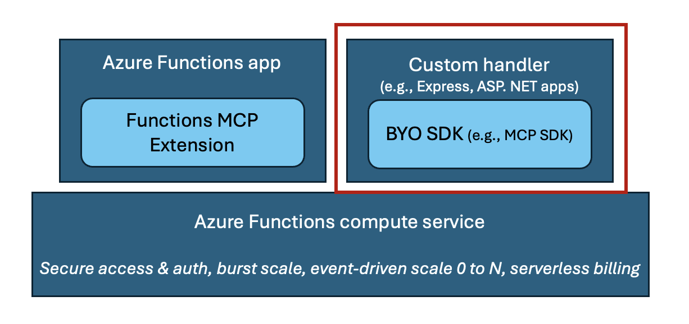

# Host remote MCP servers built with official MCP SDKs on Azure Functions

This repo contains instructions and samples for running MCP server built with the Node MCP SDK on Azure Functions. The repo uses the weather sample server to demonstrate how this can be done. You can clone to run and test the server locally, follow by easy deploy with `azd up` to have it in the cloud in a few minutes. You can follow the instructions provided to manually add the required Functions related artifacts, or have Visual Studio Code's Copilot make those additions for you by using the experimental prompt provided. 

Find the repo for other languages: 
| Language (Stack) | Repo Location |
|------------------|---------------|
| C# (.NET) | [dotnet-mcp-sdk-functions-hosting]() |
| Python | [python-mcp-sdk-functions-hosting]() |

## Running MCP server as custom handler on Azure Functions
Recently Azure Functions released the [Functions MCP extension](https://techcommunity.microsoft.com/blog/appsonazureblog/build-ai-agent-tools-using-remote-mcp-with-azure-functions/4401059), allowing developers to build MCP servers using Functions programming model, which is essentially Function's event-driven framework, and host them remotely on the serverless platform. 

For those who have already built servers with Anthropic's MCP SDKs, it's also possible host the servers on Azure Functions by running them as _custom handlers_, which are lightweight web servers that receive events from the Functions host. They allow you to host your already-built MCP servers with minimal code change and benefit from Function's bursty scale, serverless pricing model, and security features.  

<div align="center">
  
</div>

## Quickstart
> [!TIP]
> If you want to get started quickly or you don't have a server yet, follow the instructions in this section. If you already have a server, skip to [Prepare Node MCP server for deployment](#prepare-node-mcp-server-for-deployment).

This repo has a sample server that contains the required Functions artifacts to be run as a custom handler. It can be deployed as is by doing the following:

1. Clone the repo
    ```
    git clone https://github.com/Azure-Samples/node-mcp-sdk-functions-hosting.git
    ```
1. Install the [Azure Developer CLI](https://learn.microsoft.com/azure/developer/azure-developer-cli/install-azd)
1. Open up the sample in VSCode and run `azd up` in the root directory

The last step will create a resource group with all the required resources, as well as deploy the server to Azure.

### Test deployed server
After deployment completes, go to the Function App resource on Azure portal to find the app's endpoint and key: Click on **function-route** -> **Get function URL** -> copy the second endpoint with Function key. It should look like:

```
https://<function app name>.azurewebsites.net/{*route}?code=<key>
```

Test on Visual Studio Code (or your favorite client):
1. Open the command palette (`cntrl/cmd+shift+p`) and search for **MCP: Add server**
2. Choose **HTTP**
3. Enter the function endpoint from above, replace `{*route}` with `mcp`

## Prepare Node MCP server for deployment 
If you have already have server, this section provides guidance on how to prepare the MCP server for deployment as a custom handler. 

> ![NOTE]
> Before moving on to the next steps, check that your server is **stateless** and uses the streamable **HTTP transport**.

### Approach 1: Use experimental prompt
You can manually take the steps below to prepare for custom handler deployment, or try out the [Azure Functions MCP server deployment helper](https://raw.githubusercontent.com/anthonychu/create-functions-mcp-server/refs/heads/main/prompts/create-functions-mcp-server.prompt.md
) to have VSCode's Copilot go through the steps by following an experimental prompt. 


### Approach 2: Manually add required artifacts 
1. In the root directory of your MCP server project, create a `host.json` with the following:
    ```json
    {
        "version": "2.0",
        "extensions": {
            "http": {
                "routePrefix": ""
            }
        },
        "customHandler": {
            "description": {
                "defaultExecutablePath": "node",
                "workingDirectory": "",
                "arguments": ["<path to compiled JavaScript file (e.g., server.js)>"]
            },
            "enableForwardingHttpRequest": true,
            "enableHttpProxyingRequest": true
        }
    }
    ```
    >![NOTE] Use `node` instead of `npm` as the executable path because the latter is not supported today. 

1. Create a folder named `function-route` in the root directory. Inside the folder, create a file named `function.json` with the following:
    ```json
    {
        "bindings": [
            {
                "authLevel": "function",
                "type": "httpTrigger",
                "direction": "in",
                "name": "req",
                "methods": ["get", "post", "put", "delete", "patch", "head", "options"],
                "route": "{*route}"
            },
            {
                "type": "http",
                "direction": "out",
                "name": "res"
            }
        ]
    }
    ```
    This file marks the MCP server as an HTTP trigger to the Functions host, allowing access to the server through an HTTP endpoint. Functions allows you to use access keys to make it harder to access function endpoints. In this case, the line `"authLevel": "function"` specifies that a key must be included in the request when accessing the MCP server. 

1. Again in the root directory, create a `local.settings.json` file with the following:

    ```json
    {
        "IsEncrypted": false,
        "Values": {
            "FUNCTIONS_WORKER_RUNTIME": "node"
        }
    }
    ```
    This file is where all the environment variables are kept. 

1. Set custom handler port for server to listen to 
Modify the MCP server code to listen for HTTP requests on the port specified by the `FUNCTIONS_CUSTOMHANDLER_PORT` environment variable. This is the only line of code that needs modification:

    ```typescript
    const PORT = process.env.FUNCTIONS_CUSTOMHANDLER_PORT || process.env.PORT || 3000;
    app.listen(PORT, (error?: Error) => {
        // code
    });
    ```

That's it! You're ready to run your MCP server locally and deploy to Azure Functions as a custom handler. 

### Test local server 

Install [Azure Functions Core Tools](https://learn.microsoft.com/azure/azure-functions/functions-run-local?tabs=windows%2Cisolated-process%2Cnode-v4%2Cpython-v2%2Chttp-trigger%2Ccontainer-apps&pivots=programming-language-typescript) if you haven't already. 

1. In the root directory, run `func start` to run the MCP server locally as a custom handler. The server is treated as an http trigger, so there will be an endpoint returned that looks like `http://localhost:7071/{*route}`.
1. Connect to the MCP server by replacing `{*route}` with `mcp`.

## Deploy MCP server to Azure Functions
1. [Create a Function app](https://learn.microsoft.com/azure/azure-functions/functions-create-function-app-portal?tabs=core-tools&pivots=flex-consumption-plan) hosted on the **Flex Consumption plan** and related resources. 
   - Choose **Node 22** as the runtime stack and version. 
   - On *Networking* tab, choose "Enable public access" to allow all IPs to access the app. This makes the deployment in next step and connect to the server for testing easy. However, this is _not_ recommended for production scenarios. 
1. Deploy the server by running the following command in the root directory:
    ```azcli
    func azure functionapp publish <function app name>
    ```
1. Follow steps in [Test deployed server](#test-deployed-server) to test. 


## Server authorization using Azure API Management (APIM)
In addition to protecting your server though function keys, you can also leverage APIM to add server authorization with Entra ID. 

[TODO] 

